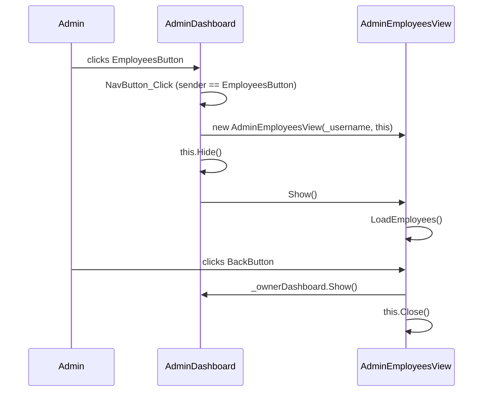

# Design Document — AdminEmployeesView

## Overview

`AdminEmployeesView` is a new WPF `Window` that opens when an admin clicks the **Employees** navigation button in `AdminDashboard`. It displays the full employee roster sourced from the MySQL `employee` table, presenting each employee with a circular avatar, bold name, and position subtitle. The view reuses the application's established dark theme (`DarkBackgroundBrush`, `CardBackgroundBrush`, `PurpleAccentBrush`), `PillButtonStyle`, `CircleButtonStyle`, and `CustomScrollbarStyle`. Filter and Sort buttons are included as visual placeholders for future functionality. The navigation bar mirrors `AdminDashboard`'s seven-button layout, with the **Employees** button rendered in the active (solid purple) state.

The design follows the exact same structural and behavioral patterns established by `AdminOverviewUI` and `AdminDashboard`, keeping the codebase consistent and predictable.

---

## Architecture

The feature touches three files:

| File | Change |
|---|---|
| `SOFTDEV/AdminEmployeesView.xaml` | **New** — WPF Window XAML |
| `SOFTDEV/AdminEmployeesView.xaml.cs` | **New** — Code-behind |
| `SOFTDEV/AdminDashboard.xaml.cs` | **Modified** — add `EmployeesButton` branch in `NavButton_Click` |

No new model types, no new database queries, and no new application-level styles are introduced. The feature reuses:

- `EmployeeEntry` record (`SOFTDEV/EmployeeEntry.cs`)
- `DatabaseHelper.GetAllEmployees()` (`SOFTDEV/DatabaseHelper.cs`)
- All styles defined in `App.xaml`

### Navigation Flow



---

## Components and Interfaces

### AdminEmployeesView (Window)

**Constructor signature** (mirrors `AdminOverviewUI`):
```csharp
public AdminEmployeesView(string username, Window? ownerDashboard = null)
```

**Public surface**:
```csharp
public List<EmployeeEntry> Employees { get; set; }
```
Exposed as a public property to enable unit testing without a live database connection.

**Private methods**:

| Method | Responsibility |
|---|---|
| `LoadEmployees()` | Calls `DatabaseHelper.GetAllEmployees()`, applies fallback on empty/exception, binds to `EmployeeListControl` |
| `BackButton_Click` | Calls `_ownerDashboard?.Show()` then `this.Close()` |
| `FilterButton_Click` | Placeholder — logs to `Debug` |
| `SortButton_Click` | Placeholder — logs to `Debug` |
| `SearchButton_Click` | Placeholder — logs to `Debug` |
| `NotificationButton_Click` | Placeholder — logs to `Debug` |
| `UserNameButton_Click` | Placeholder — logs to `Debug` |
| `AvatarButton_Click` | Placeholder — logs to `Debug` |

### AdminDashboard (modified)

One new `else if` branch added to the existing `NavButton_Click` handler:
```csharp
else if (sender == EmployeesButton)
{
    var employeesView = new AdminEmployeesView(_username, this);
    this.Hide();
    employeesView.Show();
}
```

No other changes to `AdminDashboard`.

---

## Data Models

No new data models are introduced.

### EmployeeEntry (existing, unchanged)

```csharp
public record EmployeeEntry
{
    public string Name     { get; init; }
    public string Position { get; init; }
    public EmployeeEntry(string name, string position)
    {
        Name     = name     ?? string.Empty;
        Position = position ?? string.Empty;
    }
}
```

The constructor guarantees that `Name` and `Position` are never `null` — they default to `string.Empty` when `null` is passed. This invariant is relied upon by the data binding in the `DataTemplate`.

### Fallback Data

When `DatabaseHelper.GetAllEmployees()` returns an empty list or throws, `LoadEmployees()` substitutes a hardcoded fallback of at least three entries:

```csharp
new List<EmployeeEntry>
{
    new("Alice Santos",  "Software Engineer"),
    new("Bob Reyes",     "Project Manager"),
    new("Carol Lim",     "QA Analyst"),
}
```

This ensures the UI is never blank and the `Employees.Count >= 3` invariant holds after construction regardless of database availability.

---

## XAML Layout Structure

```
Window (Background=DarkBackgroundBrush, Maximized, MinWidth=1200, MinHeight=700)
└── Grid
    ├── RowDefinition Height="Auto"  ← header + nav bar
    └── RowDefinition Height="*"     ← main content

    ├── Row 0: StackPanel (Vertical)
    │   ├── DockPanel (Margin="20,16,20,8")
    │   │   ├── Left: TextBlock "COMPANY NAME/LOGO" (PurpleAccentBrush, Bold, 18)
    │   │   └── Right: StackPanel (Horizontal)
    │   │       ├── Button SearchButton       (CircleButtonStyle, 🔍)
    │   │       ├── Button NotificationButton (CircleButtonStyle, 🔔)
    │   │       ├── Button UserNameButton     (PillButtonStyle, Width=80, Height=30)
    │   │       └── Button AvatarButton       (CircleButtonStyle, 👤)
    │   └── UniformGrid Rows="1" (Margin="20,0,20,16") — 7 nav buttons
    │       ├── Button OverviewButton    (PillButtonStyle, Opacity=0.4, hover animation)
    │       ├── Button EmployeesButton   (PillButtonStyle, Background=PurpleAccentBrush, Opacity=1.0) ← ACTIVE
    │       ├── Button AttendanceButton  (PillButtonStyle, Opacity=0.4, hover animation)
    │       ├── Button ToDoButton        (PillButtonStyle, Opacity=0.4, hover animation)
    │       ├── Button ReportsButton     (PillButtonStyle, Opacity=0.4, hover animation)
    │       ├── Button LeavesButton      (PillButtonStyle, Opacity=0.4, hover animation)
    │       └── Button SettingsButton    (PillButtonStyle, Opacity=0.4, hover animation)

    └── Row 1: ScrollViewer (CustomScrollbarStyle scoped, VerticalScrollBarVisibility=Auto)
        └── Grid (Margin="20,0,20,20")
            └── Border (CornerRadius=25, Background=#1e1e2d, Padding=24)
                └── Grid
                    ├── RowDefinition Height="Auto"  ← card header
                    └── RowDefinition Height="*"     ← employee list

                    ├── Row 0: Grid (card header)
                    │   ├── ColumnDefinition Width="*"    ← title
                    │   └── ColumnDefinition Width="Auto" ← buttons
                    │   ├── Col 0: TextBlock "My Employees" (White, Bold, FontSize=20)
                    │   └── Col 1: StackPanel (Horizontal)
                    │       ├── Button FilterButton (PillButtonStyle, "FILTER ↓", Padding="16,8", Margin right=8)
                    │       └── Button SortButton   (PillButtonStyle, "SORT ↓",   Padding="16,8")

                    └── Row 1: ScrollViewer (VerticalScrollBarVisibility=Auto, HorizontalScrollBarVisibility=Disabled)
                        └── ScrollViewer.Resources: Style TargetType=ScrollBar BasedOn=CustomScrollbarStyle
                        └── ItemsControl x:Name="EmployeeListControl"
                            └── DataTemplate (EmployeeEntry)
                                └── StackPanel (Horizontal, Margin="0,8,0,8")
                                    ├── Border (W=44, H=44, CornerRadius=22, Background=PurpleAccentBrush)
                                    │   └── TextBlock "👤" (centered)
                                    └── StackPanel (Vertical, VerticalAlignment=Center, Margin="14,0,0,0")
                                        ├── TextBlock {Binding Name}     (White, Bold, FontSize=15)
                                        └── TextBlock {Binding Position} (#aaaaaa, FontSize=12)
```

### Active Nav Tab Styling

`EmployeesButton` is the active tab. It uses `PillButtonStyle` with an explicit `Background="{StaticResource PurpleAccentBrush}"` override and `Opacity="1.0"`. All other six nav buttons use `Opacity="0.4"` with `MouseEnter`/`MouseLeave` `DoubleAnimation` triggers (fade to 1.0 on hover, back to 0.4 on leave) — identical to the pattern in `AdminOverviewUI.xaml`.

**Design rationale**: Keeping the nav bar in `AdminEmployeesView` (rather than navigating back to `AdminDashboard` and switching content) matches the existing `AdminOverviewUI` pattern. Each admin view is a self-contained `Window` that owns its own nav bar copy, with the active button highlighted. This avoids the complexity of a shared navigation host while staying consistent with the established codebase pattern.

---

## Correctness Properties

*A property is a characteristic or behavior that should hold true across all valid executions of a system — essentially, a formal statement about what the system should do. Properties serve as the bridge between human-readable specifications and machine-verifiable correctness guarantees.*

### Property 1: Username Display Invariant

*For any* non-null username string passed to the `AdminEmployeesView` constructor, the `UserNameButton.Content` property SHALL equal that username string after construction completes.

**Validates: Requirements 1.2**

### Property 2: ItemsControl Count Matches Employee List

*For any* list of `EmployeeEntry` objects loaded into `Employees` (whether from the database or the fallback), `EmployeeListControl.Items.Count` SHALL equal `Employees.Count` after `LoadEmployees()` completes.

**Validates: Requirements 5.1, 6.1**

### Property 3: Fallback Guarantee on DB Failure

*For any* outcome of `DatabaseHelper.GetAllEmployees()` that results in an empty list or throws an exception, `Employees.Count` SHALL be greater than or equal to 3 after `LoadEmployees()` completes, and no exception SHALL propagate to the caller.

**Validates: Requirements 6.2, 6.3**

---

## Error Handling

### Database Unavailability

`LoadEmployees()` wraps `DatabaseHelper.GetAllEmployees()` in a `try/catch (Exception ex)` block. On any exception:
1. The exception message is written to `System.Diagnostics.Debug.WriteLine`.
2. `Employees` is set to an empty list before the fallback check runs.
3. The fallback list (≥ 3 entries) is applied, ensuring the UI is never blank.

`DatabaseHelper.GetAllEmployees()` itself already catches `MySqlException` internally and returns an empty list. The outer catch in `LoadEmployees()` handles any unexpected exception type.

### Null Username

The `EmployeeEntry` constructor replaces `null` with `string.Empty`, so null-safety for employee data is handled at the model level. The `_username` field is typed as `string` (non-nullable), so callers must provide a valid string.

### Null Owner Dashboard

`_ownerDashboard` is typed as `Window?`. The back-navigation call uses the null-conditional operator (`_ownerDashboard?.Show()`), so passing `null` as the owner is safe and simply skips the `Show()` call.

---

## Testing Strategy

### Approach

This feature is a WPF UI window with data loading logic. The core testable logic lives in `LoadEmployees()` and the constructor — pure C# that can be exercised without rendering the UI. Property-based testing applies to the data loading invariants. Example-based unit tests cover navigation and placeholder handler behavior.

**Property-based testing library**: [FsCheck](https://fscheck.github.io/FsCheck/) (already used in the project's `SOFTDEV.Tests` test suite via `FsCheck.Xunit`).

### Unit Tests (Example-Based)

| Test | Validates |
|---|---|
| Constructor sets `UserNameButton.Content` to the provided username | Req 1.2 |
| `BackButton_Click` calls `Show()` on owner and closes the view | Req 1.3 |
| `FilterButton_Click` does not throw | Req 4.5 |
| `SortButton_Click` does not throw | Req 4.5 |
| Control group button handlers do not throw | Req 8.2 |
| `EmployeesButton` in nav bar has `Background = PurpleAccentBrush` and `Opacity = 1.0` | Req 2.1, 2.3 |

### Property-Based Tests

Each property test runs a minimum of **100 iterations**.

**Property 1 — Username Display Invariant**
```
Tag: Feature: admin-employees-view, Property 1: Username Display Invariant
For any string username, new AdminEmployeesView(username, null).UserNameButton.Content == username
```

**Property 2 — ItemsControl Count Matches Employee List**
```
Tag: Feature: admin-employees-view, Property 2: ItemsControl Count Matches Employee List
For any List<EmployeeEntry> (generated with random Name/Position strings),
after assigning to Employees and calling the binding refresh,
EmployeeListControl.Items.Count == Employees.Count
```

**Property 3 — Fallback Guarantee on DB Failure**
```
Tag: Feature: admin-employees-view, Property 3: Fallback Guarantee on DB Failure
For any exception type thrown by a stub GetAllEmployees(),
after LoadEmployees() completes: Employees.Count >= 3 and no exception propagates.
Also verified for the empty-list case.
```

### Integration Tests

| Test | Validates |
|---|---|
| `AdminDashboard.NavButton_Click` with `EmployeesButton` creates and shows `AdminEmployeesView` | Req 1.1 |
| `AdminDashboard` is hidden when `AdminEmployeesView` is shown | Req 1.1 |

### Smoke Tests (XAML / Configuration)

These are verified by code review and XAML inspection rather than runtime tests:

- `Window.Background` references `DarkBackgroundBrush`
- `WindowState="Maximized"`, `WindowStartupLocation="CenterScreen"`, `ResizeMode="CanResize"`
- Two `RowDefinitions` (`Auto` + `*`) in the top-level `Grid`
- Card `Border` has `CornerRadius="25"`, `Background="#1e1e2d"`, `Padding="24"`
- `DataTemplate` contains `AvatarCircle` (Border, CornerRadius=22, W=44, H=44), Name binding, Position binding
- `ScrollViewer` has `VerticalScrollBarVisibility="Auto"` and `HorizontalScrollBarVisibility="Disabled"`
- `CustomScrollbarStyle` applied via scoped `ScrollViewer.Resources`
- No new model types introduced; `EmployeeEntry` used throughout
- `DatabaseHelper.GetAllEmployees()` is the only DB call in the code-behind
