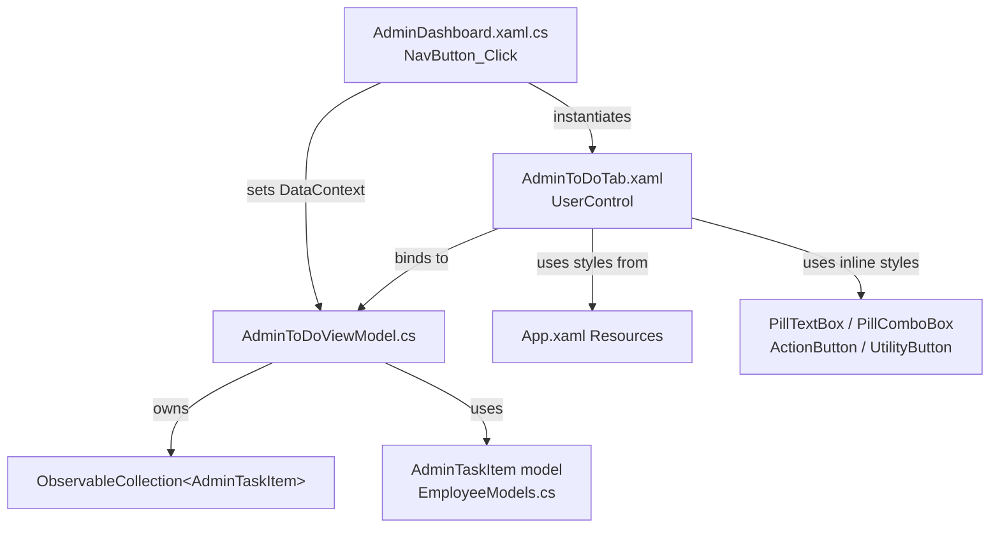

# Design Document — AdminToDoTab

## Overview

The `AdminToDoTab` feature adds a task management tab to the existing Admin Dashboard WPF window. It follows the established MVVM pattern used throughout the application: a `UserControl` (View) backed by a dedicated `ViewModel`, with all business logic isolated from the code-behind. The tab integrates into the existing `NavBar` navigation flow and matches the application's dark-purple aesthetic defined in `App.xaml`.

The feature introduces:
- A new `UserControl` at `SOFTDEV/Views/AdminToDoTab.xaml` (+ `.xaml.cs`)
- A new `ViewModel` at `SOFTDEV/ViewModels/AdminToDoViewModel.cs`
- A new `AdminTaskItem` model class added to `SOFTDEV/Models/EmployeeModels.cs`
- Modifications to `SOFTDEV/AdminDashboard.xaml.cs` to wire up the "To Do" nav button

---

## Architecture



### Component Responsibilities

| Component | Responsibility |
|---|---|
| `AdminDashboard.xaml.cs` | Handles NavBar click, instantiates `AdminToDoTab` and `AdminToDoViewModel`, sets nav button highlight colors |
| `AdminToDoTab.xaml` | Declares all UI structure, bindings, and local style resources; zero business logic |
| `AdminToDoTab.xaml.cs` | `InitializeComponent()` only; no business logic |
| `AdminToDoViewModel.cs` | Holds all state (form fields, task collection, admin name); exposes `ICommand` implementations; implements `INotifyPropertyChanged` |
| `AdminTaskItem` | Plain data model for a single task entry |

---

## File Structure

### New Files

```
SOFTDEV/
  Views/
    AdminToDoTab.xaml          ← New UserControl (View)
    AdminToDoTab.xaml.cs       ← Code-behind (InitializeComponent only)
  ViewModels/
    AdminToDoViewModel.cs      ← New ViewModel (new folder)
```

### Modified Files

```
SOFTDEV/
  Models/
    EmployeeModels.cs          ← Add AdminTaskItem class
  AdminDashboard.xaml.cs       ← Add ToDoButton branch in NavButton_Click
```

---

## Components and Interfaces

### AdminToDoTab XAML Layout Structure

The root element is a `UserControl` with `Background="{StaticResource DarkBackgroundBrush}"`. The layout uses a root `Grid` with four row definitions:

```
Root Grid
├── Row 0 (Auto)  — Header row
│   ├── Col 0: Greeting TextBlock ("Hello {AdminName}! 👋")
│   └── Col 1: UtilityButtons StackPanel (FILTER ▾, SORT ▾) — right-aligned
├── Row 1 (Auto)  — Section headers
│   ├── "To Do" bold white TextBlock
│   └── "ADD TASK:" serif TextBlock
├── Row 2 (Auto)  — Task_Form
│   ├── "Task Title: (required)" label
│   ├── PillTextBox (TaskTitle, TwoWay)
│   ├── "Description: (mandatory)" label
│   ├── PillTextBox multi-line (TaskDescription, TwoWay)
│   ├── Side-by-side row (Grid, 2 cols)
│   │   ├── PillComboBox (AssignedTo, TwoWay) + placeholder overlay
│   │   └── PillComboBox (DueDate, TwoWay) + placeholder overlay
│   └── Centered row (StackPanel Horizontal)
│       ├── ActionButton "Save"  → SaveTaskCommand
│       └── ActionButton "Cancel" → CancelTaskCommand
└── Row 3 (*)     — Task_List
    └── ScrollViewer (CustomScrollbarStyle)
        └── ItemsControl (Tasks collection)
            ├── Empty state: "No tasks yet." TextBlock (Visibility via DataTrigger)
            └── DataTemplate: task card per AdminTaskItem
```

#### XAML Namespace Declaration

```xml
<UserControl x:Class="SOFTDEV.Views.AdminToDoTab"
             xmlns="http://schemas.microsoft.com/winfx/2006/xaml/presentation"
             xmlns:x="http://schemas.microsoft.com/winfx/2006/xaml"
             xmlns:vm="clr-namespace:SOFTDEV.ViewModels"
             Background="{StaticResource DarkBackgroundBrush}">
```

### AdminDashboard Integration

In `AdminDashboard.xaml.cs`, the `NavButton_Click` handler gains a new branch:

```csharp
else if (sender == ToDoButton)
{
    // Clear MainContentGrid children
    MainContentGrid.Children.Clear();
    MainContentGrid.ColumnDefinitions.Clear();

    // Set nav button highlight colors
    ToDoButton.Background     = new SolidColorBrush((Color)ColorConverter.ConvertFromString("#5e4eb7"));
    OverviewButton.Background = new SolidColorBrush((Color)ColorConverter.ConvertFromString("#a294f9"));
    EmployeesButton.Background = new SolidColorBrush((Color)ColorConverter.ConvertFromString("#a294f9"));
    AttendanceButton.Background = new SolidColorBrush((Color)ColorConverter.ConvertFromString("#a294f9"));
    ReportsButton.Background  = new SolidColorBrush((Color)ColorConverter.ConvertFromString("#a294f9"));
    LeavesButton.Background   = new SolidColorBrush((Color)ColorConverter.ConvertFromString("#a294f9"));
    SettingsButton.Background = new SolidColorBrush((Color)ColorConverter.ConvertFromString("#a294f9"));

    // Instantiate and attach the tab
    var vm = new AdminToDoViewModel(_username);
    var todoTab = new AdminToDoTab { DataContext = vm };
    Grid.SetColumnSpan(todoTab, 3);
    MainContentGrid.Children.Add(todoTab);
}
```

The `MainContentGrid` already has 3 columns defined in XAML. The `AdminToDoTab` spans all 3 columns via `Grid.SetColumnSpan`, giving it the full content width — consistent with how `AttendanceDashboard` takes over the full window.

---

## Data Models

### AdminTaskItem (new, in `SOFTDEV/Models/EmployeeModels.cs`)

```csharp
/// <summary>
/// Represents a task created by an admin in the AdminToDoTab.
/// </summary>
public class AdminTaskItem
{
    public Guid     Id          { get; set; } = Guid.NewGuid();
    public string   Title       { get; set; } = string.Empty;
    public string   Description { get; set; } = string.Empty;
    public string   AssignedTo  { get; set; } = string.Empty;
    public string?  DueDate     { get; set; }          // stored as display string
    public DateTime CreatedAt   { get; set; } = DateTime.Now;
    public string   Status      { get; set; } = "Pending";
}
```

`DueDate` is stored as a `string?` to match the PillComboBox approach (no native DatePicker), keeping the binding simple and avoiding a value converter. If a real date picker is introduced later, this can be changed to `DateTime?` with a `StringToDateTimeConverter`.

The existing `TaskItem` class in `EmployeeModels.cs` is **not** reused — it is designed for the employee-facing task view (with `Priority`, `Progress`, `PriorityColor` fields) and does not match the admin form's data shape.

### AdminToDoViewModel (new, in `SOFTDEV/ViewModels/AdminToDoViewModel.cs`)

```csharp
public class AdminToDoViewModel : INotifyPropertyChanged
{
    // ── Greeting ──────────────────────────────────────────────────────
    public string AdminName { get; }   // set once in constructor, no setter needed

    // ── Form fields (TwoWay bindings) ─────────────────────────────────
    private string _taskTitle       = string.Empty;
    private string _taskDescription = string.Empty;
    private string _assignedTo      = string.Empty;
    private string? _dueDate;

    public string  TaskTitle       { get => _taskTitle;       set { _taskTitle = value;       OnPropertyChanged(); SaveTaskCommand.RaiseCanExecuteChanged(); } }
    public string  TaskDescription { get => _taskDescription; set { _taskDescription = value; OnPropertyChanged(); } }
    public string  AssignedTo      { get => _assignedTo;      set { _assignedTo = value;      OnPropertyChanged(); } }
    public string? DueDate         { get => _dueDate;         set { _dueDate = value;         OnPropertyChanged(); } }

    // ── Task collection ───────────────────────────────────────────────
    public ObservableCollection<AdminTaskItem> Tasks { get; } = new();

    // ── Commands ──────────────────────────────────────────────────────
    public RelayCommand SaveTaskCommand   { get; }
    public RelayCommand CancelTaskCommand { get; }
    public RelayCommand FilterCommand     { get; }
    public RelayCommand SortCommand       { get; }

    // ── Constructor ───────────────────────────────────────────────────
    public AdminToDoViewModel(string adminName)
    {
        AdminName = adminName;

        SaveTaskCommand = new RelayCommand(
            execute:    _ => ExecuteSave(),
            canExecute: _ => !string.IsNullOrWhiteSpace(TaskTitle)
        );

        CancelTaskCommand = new RelayCommand(_ => ExecuteCancel());
        FilterCommand     = new RelayCommand(_ => { /* stub */ });
        SortCommand       = new RelayCommand(_ => { /* stub */ });
    }

    private void ExecuteSave()
    {
        Tasks.Add(new AdminTaskItem
        {
            Title       = TaskTitle.Trim(),
            Description = TaskDescription.Trim(),
            AssignedTo  = AssignedTo,
            DueDate     = DueDate,
            CreatedAt   = DateTime.Now,
            Status      = "Pending"
        });
        ExecuteCancel();   // clear form after save
    }

    private void ExecuteCancel()
    {
        TaskTitle       = string.Empty;
        TaskDescription = string.Empty;
        AssignedTo      = string.Empty;
        DueDate         = null;
    }

    // ── INotifyPropertyChanged ────────────────────────────────────────
    public event PropertyChangedEventHandler? PropertyChanged;
    protected void OnPropertyChanged([CallerMemberName] string? name = null)
        => PropertyChanged?.Invoke(this, new PropertyChangedEventArgs(name));
}
```

A lightweight `RelayCommand` helper class will be added to `SOFTDEV/ViewModels/RelayCommand.cs`:

```csharp
public class RelayCommand : ICommand
{
    private readonly Action<object?> _execute;
    private readonly Func<object?, bool>? _canExecute;

    public RelayCommand(Action<object?> execute, Func<object?, bool>? canExecute = null)
    {
        _execute    = execute;
        _canExecute = canExecute;
    }

    public bool CanExecute(object? parameter) => _canExecute?.Invoke(parameter) ?? true;
    public void Execute(object? parameter)    => _execute(parameter);

    public event EventHandler? CanExecuteChanged;
    public void RaiseCanExecuteChanged() => CanExecuteChanged?.Invoke(this, EventArgs.Empty);
}
```

---

## Style Definitions

All four styles are defined as local resources inside `AdminToDoTab.xaml`'s `<UserControl.Resources>` block. They are not added to `App.xaml` because they are specific to this tab.

### PillTextBox

```xml
<Style x:Key="PillTextBoxStyle" TargetType="TextBox">
    <Setter Property="Foreground"   Value="White" />
    <Setter Property="CaretBrush"   Value="White" />
    <Setter Property="FontSize"     Value="14" />
    <Setter Property="Template">
        <Setter.Value>
            <ControlTemplate TargetType="TextBox">
                <Border Background="#4a447d"
                        CornerRadius="25"
                        Padding="20,10">
                    <ScrollViewer x:Name="PART_ContentHost"
                                  Focusable="False"
                                  HorizontalScrollBarVisibility="Hidden"
                                  VerticalScrollBarVisibility="Hidden" />
                </Border>
            </ControlTemplate>
        </Setter.Value>
    </Setter>
</Style>
```

### PillComboBox

The PillComboBox uses a fully custom `ControlTemplate` to avoid the native ComboBox chrome. A `Grid` overlay provides the content area (left) and the "▾" arrow indicator (right). Placeholder text is a `TextBlock` that collapses via a `DataTrigger` when `SelectedItem != null`.

```xml
<Style x:Key="PillComboBoxStyle" TargetType="ComboBox">
    <Setter Property="Foreground" Value="White" />
    <Setter Property="FontSize"   Value="14" />
    <Setter Property="Template">
        <Setter.Value>
            <ControlTemplate TargetType="ComboBox">
                <Grid>
                    <Border Background="#4a447d"
                            CornerRadius="25"
                            Padding="20,10">
                        <Grid>
                            <Grid.ColumnDefinitions>
                                <ColumnDefinition Width="*" />
                                <ColumnDefinition Width="Auto" />
                            </Grid.ColumnDefinitions>
                            <!-- Selected value or placeholder -->
                            <Grid Grid.Column="0">
                                <ContentPresenter x:Name="ContentSite"
                                                  Content="{TemplateBinding SelectionBoxItem}"
                                                  VerticalAlignment="Center" />
                                <TextBlock x:Name="Placeholder"
                                           Text="{TemplateBinding Tag}"
                                           Foreground="#aaaaaa"
                                           VerticalAlignment="Center"
                                           IsHitTestVisible="False" />
                            </Grid>
                            <!-- Arrow indicator -->
                            <TextBlock Grid.Column="1"
                                       Text="▾"
                                       Foreground="White"
                                       VerticalAlignment="Center"
                                       Margin="8,0,0,0" />
                        </Grid>
                    </Border>
                    <!-- Dropdown popup -->
                    <Popup x:Name="PART_Popup"
                           IsOpen="{TemplateBinding IsDropDownOpen}"
                           Placement="Bottom"
                           AllowsTransparency="True">
                        <Border Background="#4a447d"
                                CornerRadius="12"
                                Padding="4">
                            <ScrollViewer>
                                <ItemsPresenter />
                            </ScrollViewer>
                        </Border>
                    </Popup>
                </Grid>
                <ControlTemplate.Triggers>
                    <Trigger Property="SelectedItem" Value="{x:Null}">
                        <Setter TargetName="Placeholder" Property="Visibility" Value="Visible" />
                        <Setter TargetName="ContentSite" Property="Visibility" Value="Collapsed" />
                    </Trigger>
                    <Trigger Property="SelectedItem" Value="{x:Null}">
                        <!-- inverse handled by default Visibility="Collapsed" on Placeholder -->
                    </Trigger>
                </ControlTemplate.Triggers>
            </ControlTemplate>
        </Setter.Value>
    </Setter>
</Style>
```

The `Tag` property on each `ComboBox` instance carries the placeholder string (e.g., `Tag="Assigned to:"`), keeping the style reusable without code-behind.

### ActionButton

```xml
<Style x:Key="ActionButtonStyle" TargetType="Button">
    <Setter Property="Background"  Value="#8b7ed6" />
    <Setter Property="Foreground"  Value="Black" />
    <Setter Property="FontWeight"  Value="Bold" />
    <Setter Property="FontSize"    Value="14" />
    <Setter Property="Cursor"      Value="Hand" />
    <Setter Property="Template">
        <Setter.Value>
            <ControlTemplate TargetType="Button">
                <Border x:Name="Bd"
                        Background="{TemplateBinding Background}"
                        CornerRadius="25"
                        Padding="32,12">
                    <ContentPresenter HorizontalAlignment="Center"
                                      VerticalAlignment="Center" />
                </Border>
                <ControlTemplate.Triggers>
                    <Trigger Property="IsMouseOver" Value="True">
                        <Setter TargetName="Bd" Property="Background" Value="#7b6ec8" />
                    </Trigger>
                    <Trigger Property="IsEnabled" Value="False">
                        <Setter TargetName="Bd" Property="Background" Value="#3a3560" />
                        <Setter TargetName="Bd" Property="Opacity"    Value="0.5" />
                    </Trigger>
                </ControlTemplate.Triggers>
            </ControlTemplate>
        </Setter.Value>
    </Setter>
</Style>
```

### UtilityButton

```xml
<Style x:Key="UtilityButtonStyle" TargetType="Button">
    <Setter Property="Background"  Value="#554a9e" />
    <Setter Property="Foreground"  Value="White" />
    <Setter Property="FontSize"    Value="12" />
    <Setter Property="Opacity"     Value="0.7" />
    <Setter Property="Cursor"      Value="Hand" />
    <Setter Property="Template">
        <Setter.Value>
            <ControlTemplate TargetType="Button">
                <Border x:Name="Bd"
                        Background="{TemplateBinding Background}"
                        CornerRadius="20"
                        Padding="14,6"
                        Opacity="{TemplateBinding Opacity}">
                    <ContentPresenter HorizontalAlignment="Center"
                                      VerticalAlignment="Center" />
                </Border>
                <ControlTemplate.Triggers>
                    <Trigger Property="IsMouseOver" Value="True">
                        <Setter TargetName="Bd" Property="Opacity" Value="1.0" />
                    </Trigger>
                </ControlTemplate.Triggers>
            </ControlTemplate>
        </Setter.Value>
    </Setter>
</Style>
```

---

## Data Flow / Binding Map

```
AdminDashboard.xaml.cs
  └─ new AdminToDoViewModel(_username)
       └─ AdminToDoTab.DataContext = vm

AdminToDoTab.xaml bindings:
  TextBlock.Text          ← {Binding AdminName, StringFormat='Hello {0}! 👋'}
  PillTextBox (Title)     ↔ {Binding TaskTitle,       Mode=TwoWay, UpdateSourceTrigger=PropertyChanged}
  PillTextBox (Desc)      ↔ {Binding TaskDescription, Mode=TwoWay, UpdateSourceTrigger=PropertyChanged}
  PillComboBox (Assignee) ↔ {Binding AssignedTo,      Mode=TwoWay}
  PillComboBox (DueDate)  ↔ {Binding DueDate,         Mode=TwoWay}
  Save Button.Command      → {Binding SaveTaskCommand}
  Cancel Button.Command    → {Binding CancelTaskCommand}
  Filter Button.Command    → {Binding FilterCommand}
  Sort Button.Command      → {Binding SortCommand}
  ItemsControl.ItemsSource ← {Binding Tasks}

CanExecute flow:
  TaskTitle property setter → calls SaveTaskCommand.RaiseCanExecuteChanged()
  SaveTaskCommand.CanExecute → !string.IsNullOrWhiteSpace(TaskTitle)
  WPF Button.IsEnabled      ← CanExecute result (automatic via CommandManager)
```

---

## Correctness Properties

*A property is a characteristic or behavior that should hold true across all valid executions of a system — essentially, a formal statement about what the system should do. Properties serve as the bridge between human-readable specifications and machine-verifiable correctness guarantees.*

### Property 1: AdminName binding reflects constructor input

*For any* non-null string passed as `adminName` to the `AdminToDoViewModel` constructor, the `AdminName` property SHALL equal that string.

**Validates: Requirements 2.3**

### Property 2: SaveTaskCommand.CanExecute is false for empty or whitespace TaskTitle

*For any* string that is null, empty, or composed entirely of whitespace characters, setting `TaskTitle` to that value SHALL cause `SaveTaskCommand.CanExecute` to return `false`.

**Validates: Requirements 4.4, 8.5**

### Property 3: Saving a valid task adds exactly one item to the Tasks collection

*For any* `AdminToDoViewModel` with a non-empty `TaskTitle`, invoking `SaveTaskCommand.Execute` SHALL increase `Tasks.Count` by exactly 1, and the newly added item SHALL have a `Title` equal to the trimmed `TaskTitle` value.

**Validates: Requirements 10.1**

### Property 4: CancelTaskCommand resets all form fields

*For any* `AdminToDoViewModel` with arbitrary values in `TaskTitle`, `TaskDescription`, `AssignedTo`, and `DueDate`, invoking `CancelTaskCommand.Execute` SHALL set `TaskTitle` and `TaskDescription` to `string.Empty`, `AssignedTo` to `string.Empty`, and `DueDate` to `null`.

**Validates: Requirements 8.3, 14.2**

---

## Error Handling

| Scenario | Handling |
|---|---|
| `TaskTitle` is empty or whitespace | `SaveTaskCommand.CanExecute` returns `false`; Save button is visually disabled; no item is added |
| `AdminName` is null or empty | Greeting renders as "Hello ! 👋" — no crash; a future enhancement can provide a fallback display name |
| `Tasks` collection is empty | `ItemsControl` shows a "No tasks yet." placeholder via a `DataTrigger` on `Tasks.Count == 0` |
| `DueDate` is null | `AdminTaskItem.DueDate` is stored as `null`; task card renders an empty due date field without crashing |
| Database unavailable | This tab is in-memory only (v1); no database calls are made, so no DB error handling is needed |

---

## Testing Strategy

### Unit Tests (xUnit or MSTest, matching project conventions)

Unit tests cover specific examples, edge cases, and ViewModel logic:

- **ViewModel construction**: `AdminToDoViewModel("Alice")` → `AdminName == "Alice"`
- **CanExecute — empty title**: `TaskTitle = ""` → `SaveTaskCommand.CanExecute(null) == false`
- **CanExecute — whitespace title**: `TaskTitle = "   "` → `SaveTaskCommand.CanExecute(null) == false`
- **CanExecute — valid title**: `TaskTitle = "Fix bug"` → `SaveTaskCommand.CanExecute(null) == true`
- **Save adds item**: set valid title, execute Save → `Tasks.Count == 1`, `Tasks[0].Title == "Fix bug"`
- **Save clears form**: after Save, `TaskTitle == ""`, `TaskDescription == ""`, `AssignedTo == ""`, `DueDate == null`
- **Cancel clears form**: set all fields, execute Cancel → all fields reset
- **Empty state**: new ViewModel → `Tasks.Count == 0`
- **Multiple saves**: execute Save 3 times with different titles → `Tasks.Count == 3`

### Property-Based Tests (FsCheck or CsCheck for .NET)

Property tests verify universal invariants across generated inputs. Each test runs a minimum of 100 iterations.

**PBT Library**: [FsCheck](https://fscheck.github.io/FsCheck/) (idiomatic for .NET; integrates with xUnit via `FsCheck.Xunit`)

**Property 1 — AdminName binding reflects constructor input**
```
// Feature: admin-todo-tab, Property 1: AdminName binding reflects constructor input
[Property]
bool AdminName_ReflectsConstructorInput(NonNull<string> name)
{
    var vm = new AdminToDoViewModel(name.Get);
    return vm.AdminName == name.Get;
}
```

**Property 2 — CanExecute false for empty/whitespace TaskTitle**
```
// Feature: admin-todo-tab, Property 2: SaveTaskCommand.CanExecute is false for empty or whitespace TaskTitle
[Property]
bool CanExecute_FalseForWhitespaceTitle(string title)
{
    // Restrict to null, empty, or whitespace-only strings
    if (!string.IsNullOrWhiteSpace(title)) return true; // vacuously true for non-whitespace
    var vm = new AdminToDoViewModel("Admin");
    vm.TaskTitle = title ?? string.Empty;
    return !vm.SaveTaskCommand.CanExecute(null);
}
```

**Property 3 — Save adds exactly one item with correct Title**
```
// Feature: admin-todo-tab, Property 3: Saving a valid task adds exactly one item to the Tasks collection
[Property]
bool Save_AddsExactlyOneItem(NonWhiteSpaceString title)
{
    var vm = new AdminToDoViewModel("Admin");
    vm.TaskTitle = title.Get;
    int countBefore = vm.Tasks.Count;
    vm.SaveTaskCommand.Execute(null);
    return vm.Tasks.Count == countBefore + 1
        && vm.Tasks.Last().Title == title.Get.Trim();
}
```

**Property 4 — Cancel resets all form fields**
```
// Feature: admin-todo-tab, Property 4: CancelTaskCommand resets all form fields
[Property]
bool Cancel_ResetsAllFields(string title, string desc, string assignee, string? due)
{
    var vm = new AdminToDoViewModel("Admin");
    vm.TaskTitle       = title ?? string.Empty;
    vm.TaskDescription = desc  ?? string.Empty;
    vm.AssignedTo      = assignee ?? string.Empty;
    vm.DueDate         = due;
    vm.CancelTaskCommand.Execute(null);
    return vm.TaskTitle       == string.Empty
        && vm.TaskDescription == string.Empty
        && vm.AssignedTo      == string.Empty
        && vm.DueDate         == null;
}
```

### Integration / Smoke Tests

- **NavBar highlight**: after clicking ToDoButton, verify `ToDoButton.Background` is `#5e4eb7` and all other nav buttons are `#a294f9` (manual or UI automation test)
- **UserControl loads**: instantiate `AdminToDoTab` with a valid `DataContext` and verify no exceptions are thrown during `InitializeComponent()`
- **Accessibility attributes**: verify `AutomationProperties.Name` is set on Save, Cancel, Filter, Sort buttons (UI automation test)
