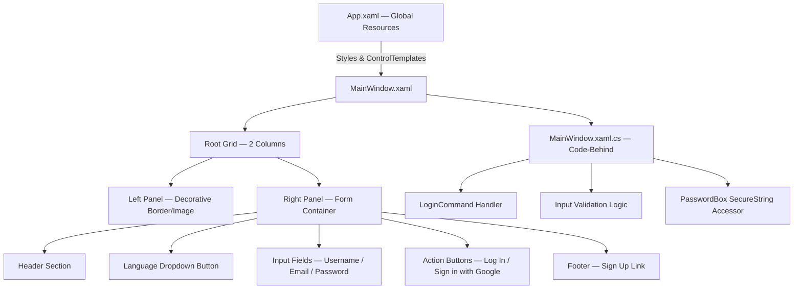
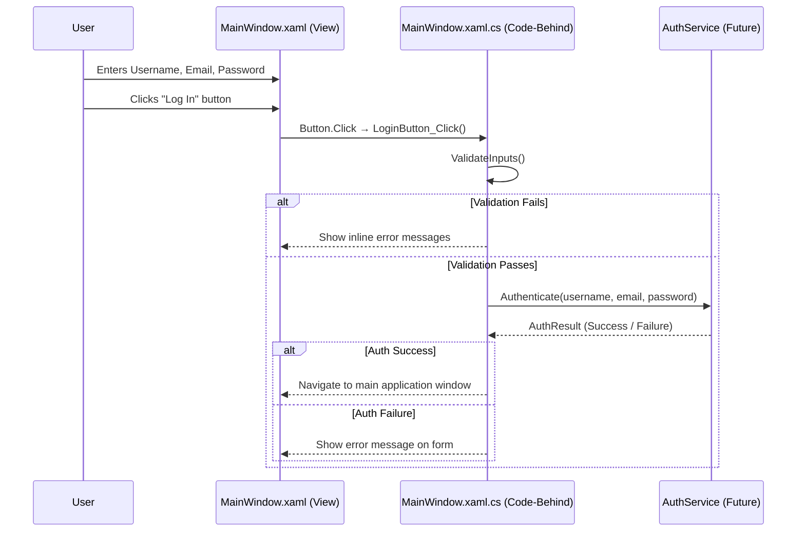
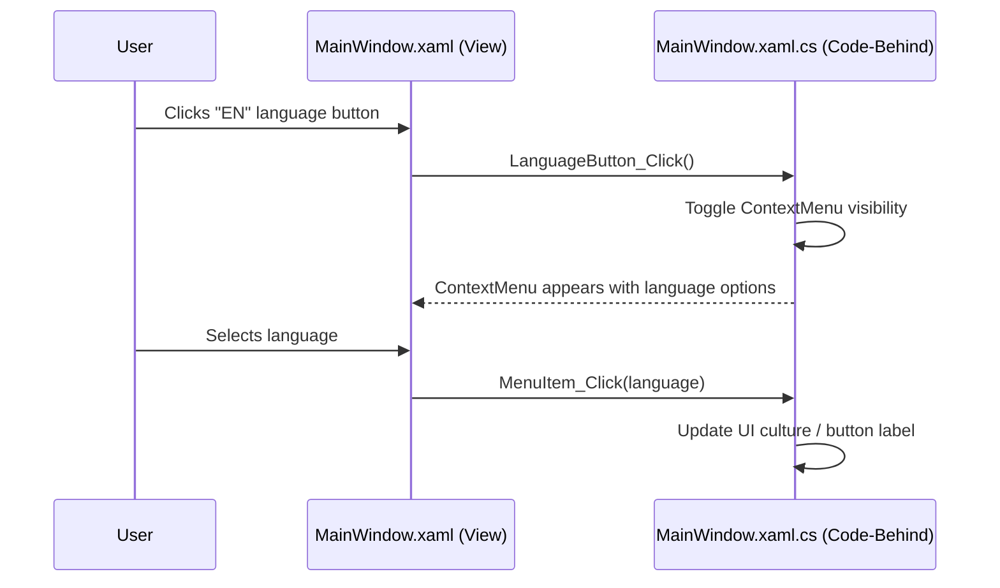

# Design Document: Modern Dark Login UI

## Overview

This feature replaces the current placeholder `MainWindow.xaml` with a polished, modern dark-themed login screen for the SOFTDEV WPF application (.NET 10). The UI is split into two columns — a decorative left panel and a functional right-side form container — using a deep black/charcoal palette with vibrant purple accents. All interactive controls (text boxes, buttons) are styled via WPF `ControlTemplate`s to achieve pill-shaped and rounded-corner geometry without third-party libraries.

The design is self-contained within `MainWindow.xaml` and `MainWindow.xaml.cs`, with all styles defined in `App.xaml` resources so they can be reused across future windows. No external NuGet packages are required.

---

## Architecture



---

## Sequence Diagrams

### Login Flow



### Language Dropdown Flow



---

## Components and Interfaces

### Component 1: Root Layout Grid

**Purpose**: Divides the window into two proportional columns using `ColumnDefinition` with star-sizing.

**XAML Structure**:
```xml
<Grid Background="#0a0a0a">
    <Grid.ColumnDefinitions>
        <ColumnDefinition Width="1*" />
        <ColumnDefinition Width="1.2*" />
    </Grid.ColumnDefinitions>
    <!-- Left Panel in Column 0 -->
    <!-- Right Panel in Column 1 -->
</Grid>
```

**Responsibilities**:
- Provides proportional 1:1.2 split between decorative and form areas
- Stretches to fill the window; adapts when window is resized
- Sets the global background color `#0a0a0a`

---

### Component 2: Left Decorative Panel

**Purpose**: Visual branding area with a large-radius border and stylized background image or gradient.

**XAML Structure**:
```xml
<Border Grid.Column="0"
        CornerRadius="25"
        Margin="20"
        Background="#1a1a2e">
    <Image Source="/images/login-bg.png"
           Stretch="UniformToFill"
           Opacity="0.6" />
</Border>
```

**Responsibilities**:
- Displays decorative background (image or gradient fallback)
- Rounded corners (25px) for modern aesthetic
- Does not participate in form logic

---

### Component 3: Right Form Container

**Purpose**: Dark charcoal card that hosts all login form elements.

**XAML Structure**:
```xml
<Border Grid.Column="1"
        Background="#15151b"
        CornerRadius="20"
        Margin="20"
        Padding="40,30">
    <!-- Form content -->
</Border>
```

**Responsibilities**:
- Contains all interactive form elements
- Provides visual separation from the window background via `CornerRadius="20"`
- Internal padding ensures comfortable spacing

---

### Component 4: Language Dropdown Button

**Purpose**: Top-right locale selector showing current language code (e.g., "EN").

**Interface** (Code-Behind):
```csharp
private void LanguageButton_Click(object sender, RoutedEventArgs e)
{
    LanguageContextMenu.IsOpen = true;
}

private void LanguageMenuItem_Click(object sender, RoutedEventArgs e)
{
    if (sender is MenuItem item)
    {
        LanguageButton.Content = item.Header?.ToString() ?? "EN";
        // Future: apply CultureInfo to application
    }
}
```

**Responsibilities**:
- Displays current language code on a pill-shaped button
- Opens a `ContextMenu` with available language options on click
- Updates button label on selection

---

### Component 5: Labeled Input Field (Reusable Pattern)

**Purpose**: A `Label` + styled `TextBox` or `PasswordBox` pair used for each form field.

**XAML Pattern**:
```xml
<!-- Reused for each field -->
<StackPanel Margin="0,0,0,16">
    <TextBlock Text="Employee User Name"
               Foreground="#7b61ff"
               FontSize="12"
               Margin="0,0,0,4" />
    <TextBox x:Name="UsernameTextBox"
             Style="{StaticResource RoundedTextBoxStyle}" />
</StackPanel>
```

**Responsibilities**:
- Label uses accent color `#7b61ff`
- Input control uses `RoundedTextBoxStyle` / `RoundedPasswordBoxStyle`
- Stacked vertically with consistent bottom margin

---

### Component 6: Action Buttons

**Purpose**: Primary "Log In" button and secondary "Sign in with Google" button, both pill-shaped.

**Interface** (Code-Behind):
```csharp
private void LoginButton_Click(object sender, RoutedEventArgs e)
{
    if (!ValidateInputs()) return;
    string username = UsernameTextBox.Text;
    string email = EmailTextBox.Text;
    string password = PasswordBox.Password;
    // Proceed with authentication
}

private void GoogleSignInButton_Click(object sender, RoutedEventArgs e)
{
    // Future: OAuth2 Google sign-in flow
}
```

**Responsibilities**:
- "Log In" triggers input validation then authentication
- "Sign in with Google" is a placeholder for OAuth integration
- Both use `PillButtonStyle` with `CornerRadius="20"` (fully rounded)

---

### Component 7: Footer Sign-Up Link

**Purpose**: Hyperlink-style text at the bottom of the form.

**XAML Structure**:
```xml
<TextBlock HorizontalAlignment="Center" Margin="0,20,0,0">
    <Run Text="Don't have an account? " Foreground="#888888" />
    <Hyperlink NavigateUri="" Click="SignUpLink_Click">
        <Run Text="Sign up" Foreground="#7b61ff" />
    </Hyperlink>
</TextBlock>
```

**Responsibilities**:
- Centered at the bottom of the form
- "Sign up" text uses accent color and is clickable
- Code-behind handler navigates to registration (future)

---

## Data Models

### LoginFormState

Represents the transient state of the login form in the code-behind.

```csharp
internal sealed class LoginFormState
{
    public string Username { get; set; } = string.Empty;
    public string Email    { get; set; } = string.Empty;
    // Password is never stored as plain string; accessed via PasswordBox.Password
    public bool   IsLoading { get; set; } = false;
    public string ErrorMessage { get; set; } = string.Empty;
}
```

**Validation Rules**:
- `Username`: non-empty, no whitespace-only value
- `Email`: non-empty, must match basic email pattern (`x@x.x`)
- `Password`: minimum 8 characters (enforced via `PasswordBox.Password.Length >= 8`)

### ValidationResult

```csharp
internal readonly record struct ValidationResult(bool IsValid, string Message)
{
    public static ValidationResult Ok()    => new(true,  string.Empty);
    public static ValidationResult Fail(string msg) => new(false, msg);
}
```

---

## Algorithmic Pseudocode

### Main Validation Algorithm

```pascal
ALGORITHM ValidateLoginInputs(username, email, password)
INPUT:  username : String
        email    : String
        password : String
OUTPUT: result   : ValidationResult

BEGIN
  IF username = "" OR username.Trim() = "" THEN
    RETURN ValidationResult.Fail("Employee User Name is required.")
  END IF

  IF email = "" OR email.Trim() = "" THEN
    RETURN ValidationResult.Fail("Email ID is required.")
  END IF

  IF NOT IsValidEmailFormat(email) THEN
    RETURN ValidationResult.Fail("Email ID is not a valid format.")
  END IF

  IF password.Length < 8 THEN
    RETURN ValidationResult.Fail("Password must be at least 8 characters.")
  END IF

  RETURN ValidationResult.Ok()
END
```

**Preconditions**:
- `username`, `email`, `password` are non-null strings (may be empty)
- `IsValidEmailFormat` is available and side-effect-free

**Postconditions**:
- Returns `ValidationResult.Ok()` if and only if all three fields pass their rules
- Returns `ValidationResult.Fail(msg)` with a descriptive message on first failure
- No mutations to input parameters

**Loop Invariants**: N/A (sequential checks, no loops)

---

### Email Format Validation Algorithm

```pascal
ALGORITHM IsValidEmailFormat(email)
INPUT:  email  : String
OUTPUT: isValid : Boolean

BEGIN
  IF email does NOT contain "@" THEN
    RETURN false
  END IF

  parts ← email.Split("@")

  IF parts.Length ≠ 2 THEN
    RETURN false
  END IF

  localPart  ← parts[0]
  domainPart ← parts[1]

  IF localPart = "" THEN
    RETURN false
  END IF

  IF domainPart does NOT contain "." THEN
    RETURN false
  END IF

  IF domainPart ends with "." THEN
    RETURN false
  END IF

  RETURN true
END
```

**Preconditions**:
- `email` is a non-null string

**Postconditions**:
- Returns `true` if and only if email has the form `local@domain.tld`
- No side effects

---

### ControlTemplate Rendering Algorithm (Conceptual)

```pascal
ALGORITHM ApplyRoundedTextBoxTemplate(textBox, cornerRadius, backgroundColor)
INPUT:  textBox         : TextBox control
        cornerRadius    : CornerRadius (e.g., 8px)
        backgroundColor : Color (e.g., #2a2a3e)
OUTPUT: styled TextBox with custom visual tree

BEGIN
  // WPF ControlTemplate replaces default visual tree
  template ← NEW ControlTemplate(targetType = TextBox)

  border ← NEW Border
  border.Background    ← backgroundColor
  border.CornerRadius  ← cornerRadius
  border.BorderBrush   ← Transparent
  border.Padding       ← Thickness(10, 8, 10, 8)

  scrollViewer ← NEW ScrollViewer(x:Name = "PART_ContentHost")
  scrollViewer.Focusable ← false

  border.Child ← scrollViewer
  template.VisualTree ← border

  textBox.Template ← template
END
```

**Preconditions**:
- `PART_ContentHost` named `ScrollViewer` must be present in the template (WPF contract)

**Postconditions**:
- TextBox renders with rounded corners and custom background
- All default TextBox functionality (cursor, selection, keyboard input) is preserved via `PART_ContentHost`

---

## Key Functions with Formal Specifications

### `ValidateInputs()` — MainWindow.xaml.cs

```csharp
private ValidationResult ValidateInputs()
```

**Preconditions**:
- `UsernameTextBox`, `EmailTextBox`, `PasswordBox` controls are initialized (non-null)
- Called only after `InitializeComponent()` has completed

**Postconditions**:
- Returns `ValidationResult.Ok()` when all fields satisfy their constraints
- Returns `ValidationResult.Fail(message)` with a non-empty message on first constraint violation
- Does not modify any control's content

**Loop Invariants**: N/A

---

### `LoginButton_Click()` — MainWindow.xaml.cs

```csharp
private void LoginButton_Click(object sender, RoutedEventArgs e)
```

**Preconditions**:
- Button is enabled (not in loading state)
- `PasswordBox.Password` is accessible

**Postconditions**:
- If validation fails: `ErrorMessageText.Visibility = Visible` with descriptive text
- If validation passes: authentication flow is initiated; button enters loading state
- `PasswordBox.Password` is read but never stored in a field or logged

**Loop Invariants**: N/A

---

### `IsValidEmailFormat()` — MainWindow.xaml.cs

```csharp
private static bool IsValidEmailFormat(string email)
```

**Preconditions**:
- `email` is non-null

**Postconditions**:
- Pure function — no side effects
- Returns `true` iff `email` matches pattern `[non-empty]@[non-empty].[non-empty]`

---

## Example Usage

### Defining the Rounded TextBox Style in App.xaml

```xml
<Application.Resources>

    <!-- Rounded TextBox Style -->
    <Style x:Key="RoundedTextBoxStyle" TargetType="TextBox">
        <Setter Property="Foreground" Value="White" />
        <Setter Property="CaretBrush" Value="White" />
        <Setter Property="FontSize" Value="14" />
        <Setter Property="Template">
            <Setter.Value>
                <ControlTemplate TargetType="TextBox">
                    <Border Background="#2a2a3e"
                            CornerRadius="8"
                            Padding="12,10">
                        <ScrollViewer x:Name="PART_ContentHost"
                                      Focusable="False"
                                      HorizontalScrollBarVisibility="Hidden"
                                      VerticalScrollBarVisibility="Hidden" />
                    </Border>
                </ControlTemplate>
            </Setter.Value>
        </Setter>
    </Style>

    <!-- Pill Button Style (Log In) -->
    <Style x:Key="PillButtonStyle" TargetType="Button">
        <Setter Property="Background" Value="#7b61ff" />
        <Setter Property="Foreground" Value="White" />
        <Setter Property="FontSize" Value="14" />
        <Setter Property="FontWeight" Value="SemiBold" />
        <Setter Property="Cursor" Value="Hand" />
        <Setter Property="Template">
            <Setter.Value>
                <ControlTemplate TargetType="Button">
                    <Border x:Name="ButtonBorder"
                            Background="{TemplateBinding Background}"
                            CornerRadius="20"
                            Padding="0,12">
                        <ContentPresenter HorizontalAlignment="Center"
                                          VerticalAlignment="Center" />
                    </Border>
                    <ControlTemplate.Triggers>
                        <Trigger Property="IsMouseOver" Value="True">
                            <Setter TargetName="ButtonBorder"
                                    Property="Background"
                                    Value="#6a52e0" />
                        </Trigger>
                        <Trigger Property="IsPressed" Value="True">
                            <Setter TargetName="ButtonBorder"
                                    Property="Background"
                                    Value="#5a44cc" />
                        </Trigger>
                    </ControlTemplate.Triggers>
                </ControlTemplate>
            </Setter.Value>
        </Setter>
    </Style>

</Application.Resources>
```

### MainWindow.xaml — Complete Form Layout Skeleton

```xml
<Window x:Class="SOFTDEV.MainWindow"
        xmlns="http://schemas.microsoft.com/winfx/2006/xaml/presentation"
        xmlns:x="http://schemas.microsoft.com/winfx/2006/xaml"
        Title="Login" Height="600" Width="900"
        WindowStartupLocation="CenterScreen"
        Background="#0a0a0a"
        ResizeMode="CanResize">

    <Grid>
        <Grid.ColumnDefinitions>
            <ColumnDefinition Width="1*" />
            <ColumnDefinition Width="1.2*" />
        </Grid.ColumnDefinitions>

        <!-- Left: Decorative Panel -->
        <Border Grid.Column="0" CornerRadius="25" Margin="20" Background="#1a1a2e">
            <Image Source="/images/login-bg.png" Stretch="UniformToFill" Opacity="0.6" />
        </Border>

        <!-- Right: Form Container -->
        <Border Grid.Column="1" Background="#15151b" CornerRadius="20" Margin="20" Padding="40,30">
            <Grid>
                <Grid.RowDefinitions>
                    <RowDefinition Height="Auto" />  <!-- Header -->
                    <RowDefinition Height="Auto" />  <!-- Subtitle -->
                    <RowDefinition Height="*"    />  <!-- Fields -->
                    <RowDefinition Height="Auto" />  <!-- Buttons -->
                    <RowDefinition Height="Auto" />  <!-- Footer -->
                </Grid.RowDefinitions>

                <!-- Language Button (top-right overlay) -->
                <Button x:Name="LanguageButton" Content="EN"
                        HorizontalAlignment="Right" VerticalAlignment="Top"
                        Style="{StaticResource PillButtonStyle}"
                        Width="50" Height="30"
                        Click="LanguageButton_Click" />

                <!-- Header -->
                <TextBlock Grid.Row="0" Text="Hi, there!"
                           Foreground="#7b61ff" FontSize="28" FontWeight="Bold" />

                <!-- Subtitle -->
                <TextBlock Grid.Row="1" Text="Welcome to SOFTDEV Portal"
                           Foreground="#aaaaaa" FontSize="14" Margin="0,4,0,24" />

                <!-- Input Fields -->
                <StackPanel Grid.Row="2">
                    <!-- Username -->
                    <TextBlock Text="User Name" Foreground="#7b61ff" FontSize="12" Margin="0,0,0,4" />
                    <TextBox x:Name="UsernameTextBox" Style="{StaticResource RoundedTextBoxStyle}" Margin="0,0,0,16" />

                    <!-- Email -->
                    <TextBlock Text="Email ID" Foreground="#7b61ff" FontSize="12" Margin="0,0,0,4" />
                    <TextBox x:Name="EmailTextBox" Style="{StaticResource RoundedTextBoxStyle}" Margin="0,0,0,16" />

                    <!-- Password -->
                    <TextBlock Text="Password (min 8 char)" Foreground="#7b61ff" FontSize="12" Margin="0,0,0,4" />
                    <PasswordBox x:Name="PasswordBox" Style="{StaticResource RoundedPasswordBoxStyle}" Margin="0,0,0,8" />

                    <!-- Error Message -->
                    <TextBlock x:Name="ErrorMessageText" Foreground="#ff6b6b"
                               FontSize="12" Visibility="Collapsed" Margin="0,0,0,8" />
                </StackPanel>

                <!-- Action Buttons -->
                <StackPanel Grid.Row="3" Margin="0,16,0,0">
                    <Button Content="Log in" Style="{StaticResource PillButtonStyle}"
                            Height="44" Margin="0,0,0,12"
                            Click="LoginButton_Click" />
                    <Button Content="Sign in with Google" Style="{StaticResource OutlinePillButtonStyle}"
                            Height="44"
                            Click="GoogleSignInButton_Click" />
                </StackPanel>

                <!-- Footer -->
                <TextBlock Grid.Row="4" HorizontalAlignment="Center" Margin="0,20,0,0">
                    <Run Text="Don't have an account? " Foreground="#888888" />
                    <Hyperlink Click="SignUpLink_Click">
                        <Run Text="Sign up" Foreground="#7b61ff" />
                    </Hyperlink>
                </TextBlock>
            </Grid>
        </Border>
    </Grid>
</Window>
```

### MainWindow.xaml.cs — Code-Behind Skeleton

```csharp
using System.Windows;
using System.Windows.Controls;

namespace SOFTDEV
{
    public partial class MainWindow : Window
    {
        public MainWindow()
        {
            InitializeComponent();
        }

        private void LoginButton_Click(object sender, RoutedEventArgs e)
        {
            ErrorMessageText.Visibility = Visibility.Collapsed;

            var result = ValidateInputs();
            if (!result.IsValid)
            {
                ErrorMessageText.Text = result.Message;
                ErrorMessageText.Visibility = Visibility.Visible;
                return;
            }

            string username = UsernameTextBox.Text;
            string email    = EmailTextBox.Text;
            string password = PasswordBox.Password;

            // TODO: Pass to AuthService
        }

        private ValidationResult ValidateInputs()
        {
            if (string.IsNullOrWhiteSpace(UsernameTextBox.Text))
                return ValidationResult.Fail("Employee User Name is required.");

            if (string.IsNullOrWhiteSpace(EmailTextBox.Text))
                return ValidationResult.Fail("Email ID is required.");

            if (!IsValidEmailFormat(EmailTextBox.Text))
                return ValidationResult.Fail("Email ID is not a valid format.");

            if (PasswordBox.Password.Length < 8)
                return ValidationResult.Fail("Password must be at least 8 characters.");

            return ValidationResult.Ok();
        }

        private static bool IsValidEmailFormat(string email)
        {
            var parts = email.Split('@');
            if (parts.Length != 2) return false;
            if (string.IsNullOrEmpty(parts[0])) return false;
            if (!parts[1].Contains('.')) return false;
            if (parts[1].EndsWith('.')) return false;
            return true;
        }

        private void LanguageButton_Click(object sender, RoutedEventArgs e)
        {
            LanguageContextMenu.IsOpen = true;
        }

        private void LanguageMenuItem_Click(object sender, RoutedEventArgs e)
        {
            if (sender is MenuItem item)
                LanguageButton.Content = item.Header?.ToString() ?? "EN";
        }

        private void GoogleSignInButton_Click(object sender, RoutedEventArgs e)
        {
            // TODO: OAuth2 Google sign-in
        }

        private void SignUpLink_Click(object sender, RoutedEventArgs e)
        {
            // TODO: Navigate to registration window
        }
    }
}
```

---

## Correctness Properties

*A property is a characteristic or behavior that should hold true across all valid executions of a system — essentially, a formal statement about what the system should do. Properties serve as the bridge between human-readable specifications and machine-verifiable correctness guarantees.*

### Property 1: Validation totality — no exceptions

*For any* combination of non-null username, email, and password strings, `ValidateInputs()` SHALL return either `ValidationResult.Ok()` or `ValidationResult.Fail(message)` and SHALL NOT throw an exception.

**Validates: Requirements 8.8**

---

### Property 2: Whitespace inputs are rejected

*For any* string composed entirely of whitespace characters (including the empty string), supplying it as the username or email field SHALL cause `ValidateInputs()` to return `ValidationResult.Fail` with a non-empty message.

**Validates: Requirements 8.1, 8.2**

---

### Property 3: Short passwords are rejected

*For any* password string whose length is strictly less than 8 characters (given a non-empty username and valid email), `ValidateInputs()` SHALL return `ValidationResult.Fail("Password must be at least 8 characters.")`.

**Validates: Requirements 8.4**

---

### Property 4: Valid inputs always pass validation

*For any* non-whitespace username, email string that satisfies `IsValidEmailFormat`, and password of length ≥ 8, `ValidateInputs()` SHALL return `ValidationResult.Ok()`.

**Validates: Requirements 8.5**

---

### Property 5: Validator is side-effect-free

*For any* inputs, calling `ValidateInputs()` SHALL NOT modify the `Text` property of `UsernameTextBox` or `EmailTextBox`, nor the `Password` property of `PasswordBox`.

**Validates: Requirements 8.7**

---

### Property 6: Email format validation is a pure function

*For any* non-null email string, calling `IsValidEmailFormat(email)` multiple times SHALL return the same result on every invocation (referential transparency / no side effects).

**Validates: Requirements 9.1, 9.7**

---

### Property 7: Invalid email formats are rejected

*For any* string that lacks exactly one `@` character, or whose local part is empty, or whose domain part contains no `.`, or whose domain part ends with `.`, `IsValidEmailFormat` SHALL return `false`.

**Validates: Requirements 9.2, 9.3, 9.4, 9.5**

---

### Property 8: Valid email formats are accepted

*For any* string of the form `[non-empty]@[non-empty].[non-empty-not-ending-with-dot]`, `IsValidEmailFormat` SHALL return `true`.

**Validates: Requirements 9.6**

---

### Property 9: Error visibility reflects validation outcome

*For any* invocation of `LoginButton_Click`, the `ErrorMessageText.Visibility` SHALL be `Collapsed` at the start of the handler; it SHALL become `Visible` if and only if `ValidateInputs()` returns `Fail`, and SHALL remain `Collapsed` if `ValidateInputs()` returns `Ok`.

**Validates: Requirements 10.1, 10.2, 10.3**

---

### Property 10: Password is never stored

*For any* login attempt, after `LoginButton_Click` completes, `PasswordBox.Password` SHALL NOT be assigned to any field, property, static variable, or log output in `MainWindow.xaml.cs`.

**Validates: Requirements 11.2, 13.3**

---

### Property 11: Proportional column layout invariant

*For any* window width greater than zero, the rendered width of the right form column SHALL be greater than the rendered width of the left decorative column (ratio 1.2:1).

**Validates: Requirements 1.3, 1.4**

---

### Property 12: Language button label reflects selection

*For any* language code string presented as a `MenuItem` header in the `LanguageContextMenu`, selecting that item SHALL update `LanguageButton.Content` to equal that language code string.

**Validates: Requirements 4.4**

---

## Error Handling

### Error Scenario 1: Empty Required Field

**Condition**: User clicks "Log In" with one or more fields blank.
**Response**: `ValidateInputs()` returns `Fail` with a field-specific message; `ErrorMessageText` becomes visible.
**Recovery**: User fills in the missing field and clicks "Log In" again; error clears at the start of the next click handler.

### Error Scenario 2: Invalid Email Format

**Condition**: Email field does not contain `@` or lacks a domain with a dot.
**Response**: `ValidationResult.Fail("Email ID is not a valid format.")` is returned; error text shown.
**Recovery**: User corrects the email and retries.

### Error Scenario 3: Password Too Short

**Condition**: `PasswordBox.Password.Length < 8`.
**Response**: `ValidationResult.Fail("Password must be at least 8 characters.")` shown.
**Recovery**: User enters a longer password.

### Error Scenario 4: Missing PART_ContentHost in ControlTemplate

**Condition**: Developer removes or renames the `ScrollViewer` named `PART_ContentHost` in a custom TextBox template.
**Response**: WPF throws `InvalidOperationException` at runtime when the control is rendered.
**Recovery**: Restore the `ScrollViewer` with `x:Name="PART_ContentHost"` inside the template.

### Error Scenario 5: Image Asset Not Found

**Condition**: `/images/login-bg.png` is missing from the project.
**Response**: WPF silently renders the `Border` with its `Background` color only; no crash.
**Recovery**: Add the image to the `images/` folder and set `Build Action = Resource`.

---

## Testing Strategy

### Unit Testing Approach

Test the pure C# logic in `MainWindow.xaml.cs` by extracting validation into a separate `LoginValidator` class (or test via the existing static methods).

Key test cases:
- `ValidateInputs` returns `Ok` when all fields are valid
- `ValidateInputs` returns `Fail` for each individual empty field
- `IsValidEmailFormat` returns `false` for `"notanemail"`, `"@domain.com"`, `"user@"`, `"user@domain"`
- `IsValidEmailFormat` returns `true` for `"user@domain.com"`, `"a@b.co"`
- Password length boundary: 7 chars → `Fail`, 8 chars → `Ok`

### Property-Based Testing Approach

**Property Test Library**: xUnit + FsCheck (or CsCheck for C#)

Properties to verify:
- For any non-empty username, non-empty valid email, and password of length ≥ 8 → `ValidateInputs` always returns `Ok`
- For any password string of length < 8 → `ValidateInputs` always returns `Fail`
- `IsValidEmailFormat` is pure: same input always produces same output
- `ValidationResult.Ok().IsValid` is always `true`; `ValidationResult.Fail(msg).IsValid` is always `false`

### UI / Integration Testing Approach

Manual smoke tests (automated UI testing via WinAppDriver is optional):
1. Launch app → verify dark background, two-column layout renders correctly
2. Click "Log In" with empty fields → verify error message appears
3. Fill all fields correctly → verify no error message
4. Resize window → verify proportional column layout is maintained
5. Hover over "Log In" button → verify purple darkens (hover trigger fires)
6. Click "EN" button → verify context menu appears

---

## Performance Considerations

- All styles and `ControlTemplate`s are defined as static resources in `App.xaml`, so WPF freezes and shares them across all instances — no per-instance template overhead.
- The decorative left panel image uses `Stretch="UniformToFill"` with `Opacity="0.6"`, which is GPU-composited and has negligible CPU cost.
- No animations or `Storyboard`s are used in the initial design; hover state changes via `Trigger` are instantaneous and do not require `DispatcherTimer`.
- The login window is a single `Window` with a shallow visual tree (~15 elements), so layout passes are fast even on low-end hardware.

---

## Security Considerations

- **Password handling**: `PasswordBox` is used instead of `TextBox` to prevent the password from appearing in the WPF visual tree or accessibility APIs. `PasswordBox.Password` (plain string) is accessed only at the moment of submission and is not stored in any field.
- **No credential caching**: The `LoginFormState` model does not persist credentials between sessions.
- **Future auth**: When connecting to a real auth service, credentials must be transmitted over HTTPS/TLS. The `password` string should be cleared from memory as soon as possible after use (consider `SecureString` for the auth call boundary).
- **Input length limits**: `MaxLength` should be set on `UsernameTextBox` and `EmailTextBox` to prevent excessively long inputs from being submitted.

---

## Dependencies

| Dependency | Version | Purpose |
|---|---|---|
| .NET 10 Windows | 10.0 | Target framework |
| WPF (PresentationFramework) | Included in .NET 10 | UI framework |
| xUnit | 2.x (optional) | Unit testing |
| FsCheck / CsCheck | Latest (optional) | Property-based testing |

No third-party UI libraries (MahApps, MaterialDesign, etc.) are required. All visual styling is achieved through native WPF `ControlTemplate`s and `Style` resources.
